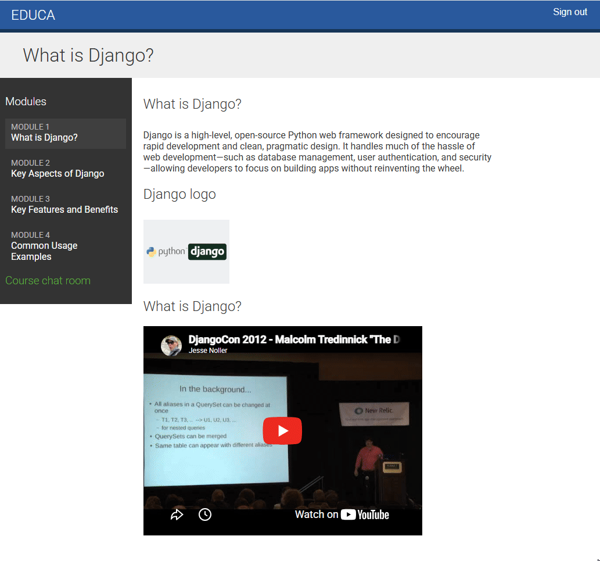
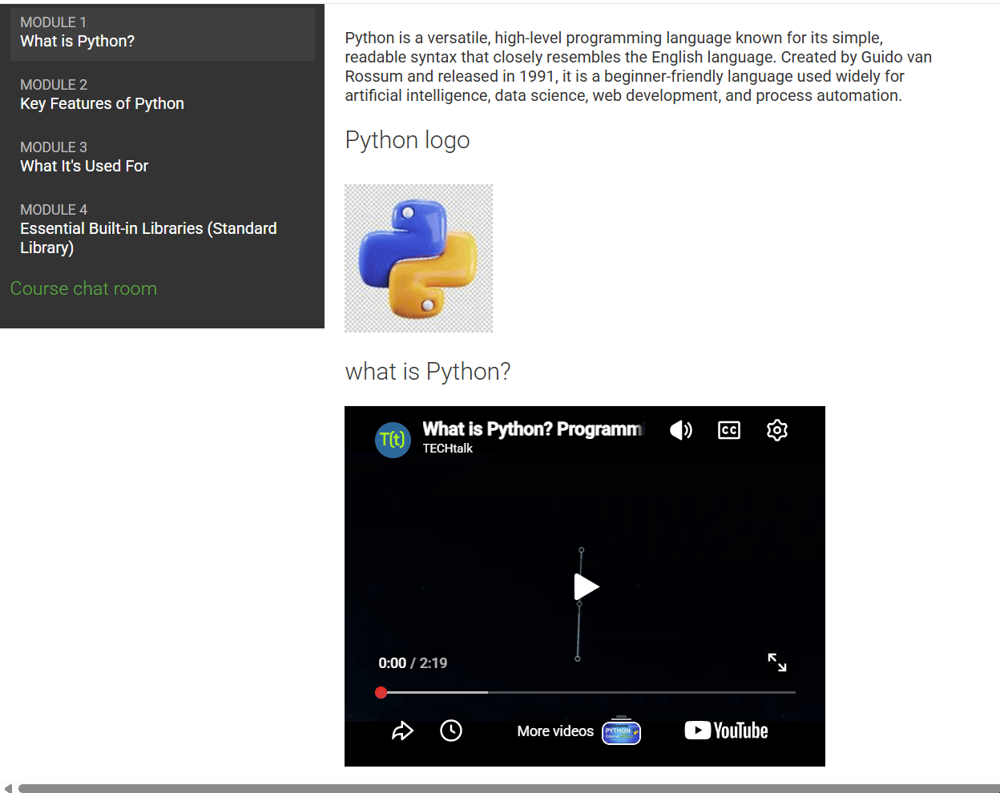
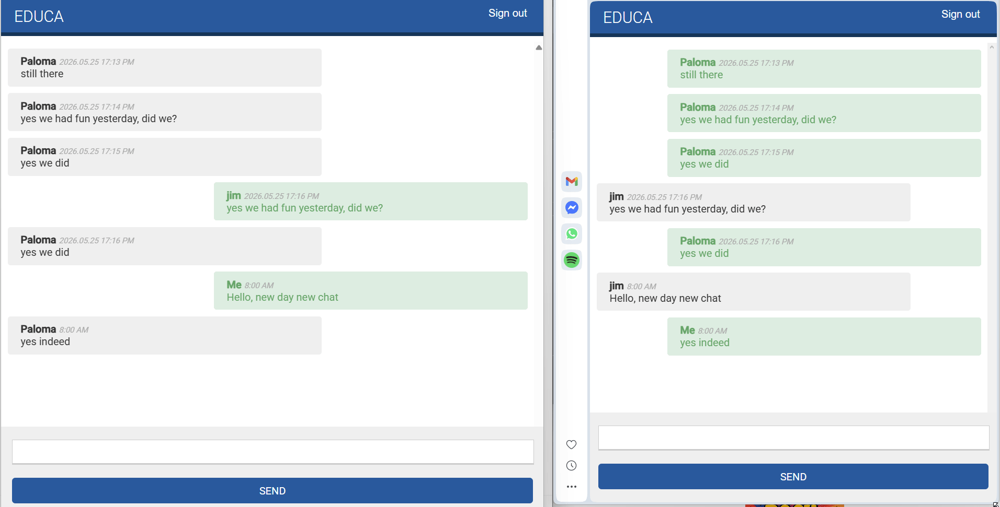

## Project Overview

This project is a Dockerized version of the final project from *Django 5 By Example* by Antonio Melé. It features REST APIs, real-time communication with WebSockets, and a fully containerized development and production setup. The project was rebuilt by me using Docker from the start as an additional implementation challenge.

---

## E-Learning Platform Development

### Building the core platform

- Course and enrollment system implementation
- Create models for the CMS
- Create fixtures for models and apply them
- Use model inheritance for polymorphic content
- Create custom model fields
- Order course contents and modules
- Build authentication views

---

### Content management system

- Create a CMS using class-based views and mixins
- Build formsets and model formsets for modules and content
- Manage groups and permissions
- Implement drag-and-drop reordering

---

### Rendering and caching

- Public course views
- Student registration system
- Course enrollment management
- Render diverse module content
- Configure Memcached
- Django cache framework integration
- Redis and Memcached backends
- Monitor Redis in Django admin

---

### API development

- Django REST framework setup
- Serializers and nested serializers
- RESTful API creation
- ViewSets and routers
- Custom API views
- Authentication and permissions
- API consumption with Requests

---

### Real-time chat system

- Django Channels integration
- WebSocket consumer and routing
- WebSocket client implementation
- Redis channel layer
- Asynchronous consumers
- Persist chat messages

---

### Production deployment

- Multi-environment Django settings
- Docker Compose multi-service setup
- PostgreSQL and Redis in containers
- uWSGI setup
- NGINX configuration
- Static file serving
- TLS/SSL configuration
- ASGI server (Daphne)
- Custom middleware
- Custom management commands

# GIF

## 🎥 GIF Django_preview.

GIF Video play

## 🎥 GIF Python_preview.

GIF Video play

## 🎥 GIF Chat room Preview

GIF Chat room Preview

## 🔗 Related Repository

This project includes a code repository documenting the full development implementation.

👉 https://github.com/jeanmarc-webdev/dockerized-e-learning-platform-portfolio
